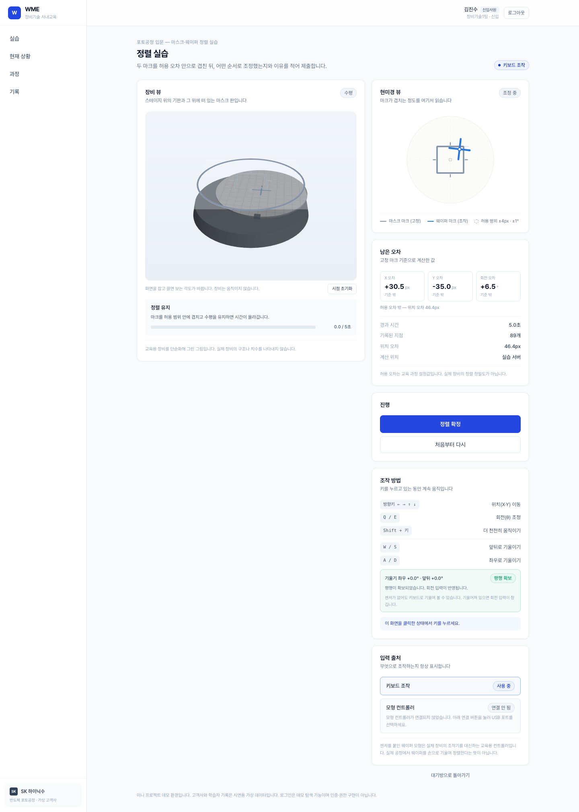
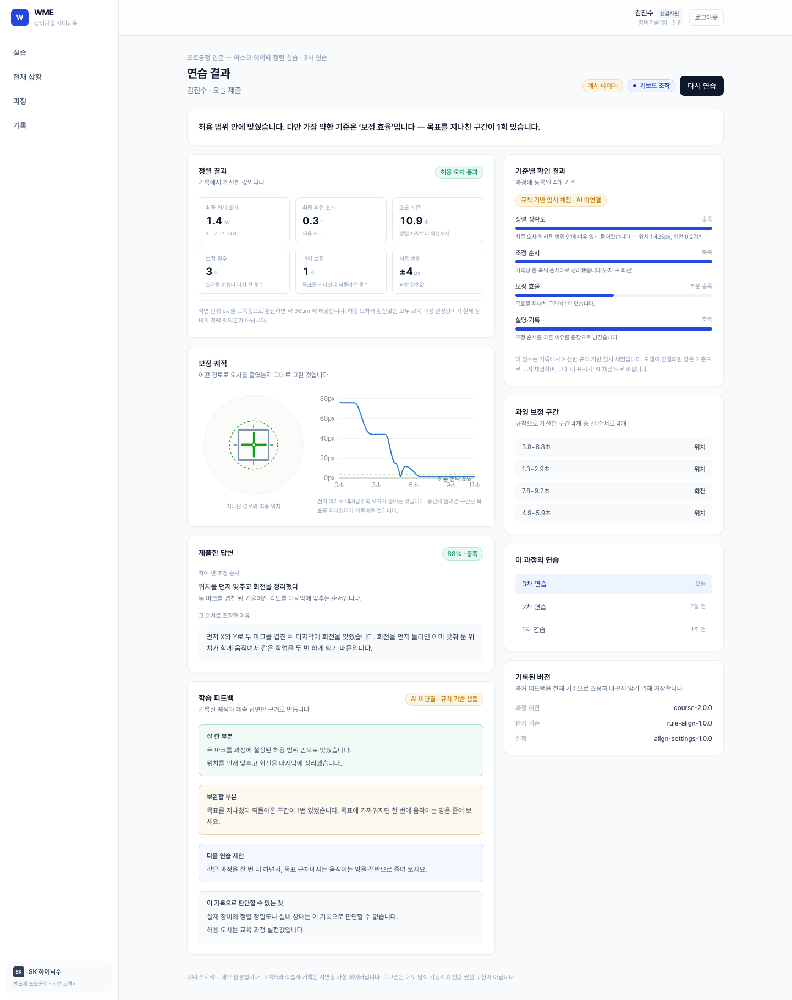

# WME — We Make Experts

> **실장비 투입 전 판단 훈련을 위한 사내 기술교육 웹 서비스**
> SKALA AI 웹 서비스 설계 Mini-project · 9반 P286 김진수 · 2026.09

신입 기술자가 실장비에 투입되기 전에 장비 조작의 원리와 "무엇을 먼저 확인할지"를 반복해서 연습하고,
매니저는 그 **실습 과정과 성취도를 기록으로** 확인합니다.
실장비 실습을 대체하지 않습니다. 그 앞 단계를 저비용으로 반복하게 합니다.

데모는 반도체 장비 기업(가상 고객사 "SK 하이닉수")에 납품한 인스턴스이며, 제품 코드는 업종 중립입니다.

<p align="center">
  
  
</p>

---

## 제출물

| 산출물 | 파일 | 확인 |
|---|---|---|
| 프로젝트 기술서 (UI 흐름도 포함) | [`제출/개요PDF/9반_P286_김진수_WME-개요_초안.pdf`](제출/개요PDF/) | 40쪽 · 기술서 28쪽 + 발표 자료 12쪽 |
| API 명세 (OpenAPI 3.0.3) | [`제출/9반_P286_김진수_WME-API.yml`](제출/9반_P286_김진수_WME-API.yml) | Swagger 파서 오류 0 · 실제 서버 응답 23건 스키마 검증 통과 |
| DB 설계 (DBML) | [`제출/9반_P286_김진수_WME-DB.dbml`](제출/9반_P286_김진수_WME-DB.dbml) | dbdiagram.io 오류 0 |

- API 명세는 [Swagger Editor](https://editor.swagger.io)에, DBML은 [dbdiagram.io](https://dbdiagram.io)에 붙여 넣어 볼 수 있습니다.
- `[설계]` 표시는 설계에만 있고 시연 앱에 구현하지 않은 항목입니다(로그인 API·비밀번호 해시).

## 문제와 해결

| 구분 | 내용 |
|---|---|
| 현황 | 신입·전환배치 기술자는 장비 원리를 설명으로 배운 뒤 곧바로 실장비에 투입됩니다 |
| 원인 | 장비 점유 · 지도 인력 · 웨이퍼 손실 위험이 모두 비용이라 실장비 실습을 반복할 수 없습니다 |
| 문제 1 (신입사원) | 조작 순서와 판단을 틀려 보고 다시 해 볼 기회가 부족합니다 |
| 문제 2 (매니저) | 결과만 보고, 누가 어디서 막히는지(보정 경로·판단 이유)는 보지 못합니다 |
| 해결 | 반복 가능한 실습 · 과정이 남는 기록 · 기준에 따른 피드백 · 매니저 가시성 |

## 시스템 구성

| 액터 | 역할 |
|---|---|
| 신입사원 | 대기방 → 정렬 실습(3D 장비 뷰) / 판단 실습 → 결과·AI 피드백 → 재실습 |
| 매니저 | 반 전체 현황 → 학습자 목록 → 학습자별 성취도와 실제 제출 기록 |
| LLM 서비스 | 분석 결과 + 답변 + 루브릭으로 학습 피드백 생성. 서버가 응답을 검증하고, 실패해도 답변·규칙 점수는 보존 |
| 교육용 모형 컨트롤러 (선택) | MPU6050 센서를 붙인 웨이퍼 모형. 브라우저가 USB로 직접 읽음(Web Serial). 없으면 키보드로 같은 실습 |

| 규모 | |
|---|---|
| 화면 | 13개 (라우트 11 + 실습 유형 2) |
| API | REST 16개(로그인 [설계] 포함) + WebSocket 1개 |
| 데이터 모델 | 19테이블 · 146컬럼 · 관계 23 · M:N 4 · enum 14 (논리 설계) |
| 시연 앱 저장 | SQLite 6테이블 + JSON 컬럼 (API는 논리 설계와 같은 구조로 응답) |

### 설계 원칙

- **판정은 서버가 합니다.** 허용 범위·경로 분석·채점은 화면이 보낸 값이 아니라 과정 설정값으로 계산합니다
- **채점 출처를 구분합니다.** 규칙 기반 채점(`rule`)과 LLM 채점(`llm`)을 필드로 나누고 화면에 표시합니다
- **AI가 실패해도 교육은 계속됩니다.** 답변 저장 → 규칙 채점 → AI 피드백 순서입니다
- **업종 중립.** 과정 내용·허용 오차·조작 계수·채점 규칙은 과정 데이터에만 있습니다
- **설정값과 한계를 명시합니다.** 허용 오차(키보드 ±4px·±1°, 센서 회전 ±3°)는 교육 과정 설정값이며 실제 장비 정밀도가 아닙니다

## 기술 스택

| 영역 | 사용 |
|---|---|
| 프론트엔드 | React 19 · TypeScript · Vite · Tailwind CSS v4 · Three.js · Recharts |
| 백엔드 | FastAPI · SQLite · WebSocket · 규칙 기반 정렬 경로 분석 · LLM 연결(OpenAI / Anthropic) |
| 하드웨어 | Arduino UNO + MPU6050 (50Hz, Web Serial) |
| 설계 도구 | OpenAPI 3.0.3 · DBML |

## 실행

```bash
./시작.sh                                                            # 설치물 확인·설치, DB 시드
cd web/backend && ./.venv/bin/python -m uvicorn app.main:app --port 8000
npm --prefix web/frontend run dev:server                              # http://localhost:5174
```

- 서버 없이 보기: `npm --prefix web/frontend run dev` (mock 모드, http://localhost:5173)
- 데모 로그인: 신입사원 `1` / `1`, 매니저 `2` / `2` — 인증 구현이 아닌 역할 전환입니다
- LLM 피드백: `web/backend/.env` 에 `WME_LLM_API_KEY` 를 넣고 `source .env` 후 서버 실행 (키는 깃에 올리지 않습니다)
- 센서: 크롬 + localhost 에서 실습 화면의 "모형 컨트롤러 연결". 펌웨어는 [`hardware/`](hardware/)

## 저장소 구조

```
├── 제출/            제출물 3종 · 개요 PDF 원본(HTML) · 캡처 · 이전 버전
├── 기획/            서비스개요 · 화면설계 · 과제요건 · 진행 상황 · 작업로그
├── web/frontend/    화면 (React + Three.js)
├── web/backend/     API 서버 (FastAPI + SQLite)
├── hardware/        Arduino 펌웨어
├── data/            센서 수집 도구 (local/ DB 는 깃 제외)
├── PROJECT_HEAD.md  제품 정의와 확정 결정
└── 이어서작업.md    작업 이어받기 안내
```

## 구현 범위

| 항목 | 상태 |
|---|---|
| 화면 13개, 정렬·판단 실습, 3D 장비 뷰, 노광·현상 연출 | 구현 |
| REST 15 + WebSocket 1, 규칙 기반 분석·채점 | 구현 |
| LLM 피드백 | 구현 (실제 호출 검증 완료) |
| 교육용 모형 컨트롤러 | 구현 (실물 모형 동작 확인) |
| 로그인 API · 비밀번호 해시 | 설계만 |
| 과정 작성·배정 화면, 배포 | 범위 밖 (다음 단계) |

---

*고객사·학습자 기록은 시연용 가상 데이터이며 실제 기업·직원 정보가 아닙니다.*
