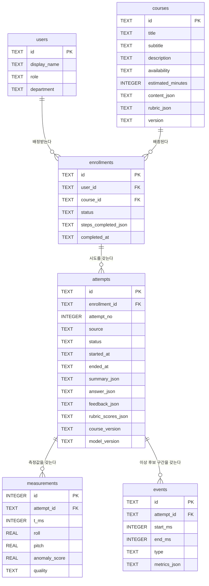

# DB 설계

> WME — We Make Experts
> 기준 시점: 2026-09-12 / 작성: HEADER 세션
> 원본 정의는 `web/frontend/src/types/index.ts` 다. **이 문서와 그 파일이 어긋나면 파일이 맞다.**
> 구현 상태: 스키마 설계 완료. 실제 DB 생성·연결은 미착수(BACK 세션).

## 1. 설계 원칙

1. **화면에 필요한 데이터만 저장한다.** 이번 과제의 DB는 화면을 위한 저장소다.
2. **기록은 덮어쓰지 않는다.** 재실습은 새 `attempts` 행이고, 이전 시도는 그대로 남는다.
3. **버전을 함께 저장한다.** 과정 내용이나 판정 기준이 바뀌어도 과거 피드백의 근거가 조용히 바뀌면 안 된다.
4. **집계값은 저장하지 않는다.** 진도·달성도는 저장된 기록에서 매번 계산한다.
   저장해두면 실제 기록과 화면 숫자가 어긋날 수 있다.
5. **고정된 소규모 구조는 JSON 컬럼으로 둔다.** 3일 일정에서 테이블 수를 늘리지 않기 위한 선택이다.

## 2. ERD



## 3. 테이블

### 3.1 `users` — 사용자

| 컬럼 | 타입 | NULL | 설명 |
|---|---|---|---|
| `id` | TEXT | PK | `u-1`, `u-instructor` |
| `display_name` | TEXT | NOT NULL | 표시 이름 |
| `role` | TEXT | NOT NULL | `learner`(신입사원) / `instructor`(매니저) |
| `department` | TEXT | NOT NULL | 소속 표시용. 실제 인사 데이터가 아니다 |

데모 계정만 저장한다. **비밀번호·개인정보를 저장하지 않는다.** 로그인은 데모 전환이며 인증 구현이 아니다.

### 3.2 `courses` — 과정

| 컬럼 | 타입 | NULL | 설명 |
|---|---|---|---|
| `id` | TEXT | PK | `stage-anomaly` |
| `title` | TEXT | NOT NULL | 과정명 |
| `subtitle` | TEXT | NOT NULL | 한 줄 설명 |
| `description` | TEXT | NOT NULL | 소개 |
| `availability` | TEXT | NOT NULL | `available` / `preview` / `coming_soon` |
| `estimated_minutes` | INTEGER | NOT NULL | 예상 소요 시간 |
| `content_json` | TEXT | NOT NULL | 학습목표·선수과정·단계·점검항목 |
| `rubric_json` | TEXT | NOT NULL | 평가 기준 4개. **성취도 그래프의 축이 된다** |
| `version` | TEXT | NOT NULL | `course-1.0.0`. attempt에 복사 저장된다 |

`availability` 가 `available` 인 과정만 실습 시도를 만들 수 있다.

### 3.3 `enrollments` — 배정·진도

| 컬럼 | 타입 | NULL | 설명 |
|---|---|---|---|
| `id` | TEXT | PK | |
| `user_id` | TEXT | FK → users | |
| `course_id` | TEXT | FK → courses | |
| `status` | TEXT | NOT NULL | `not_started` / `in_progress` / `completed` |
| `steps_completed_json` | TEXT | NOT NULL | 완료한 단계 ID 배열 |
| `completed_at` | TEXT | NULL | 이수 시각 |

**진도는 `steps_completed_json` 으로만 계산한다.** 페이지 방문이나 경과 시간으로 올리지 않는다.

### 3.4 `attempts` — 실습 시도

| 컬럼 | 타입 | NULL | 설명 |
|---|---|---|---|
| `id` | TEXT | PK | |
| `enrollment_id` | TEXT | FK → enrollments | |
| `attempt_no` | INTEGER | NOT NULL | 해당 배정에서 몇 번째 시도인가 |
| `source` | TEXT | NOT NULL | `mock` 예시 / `replay` 재생 / `live` 실시간 |
| `status` | TEXT | NOT NULL | `measuring` → `measured` → `submitted` → `feedback_ready` / `feedback_failed` |
| `started_at` | TEXT | NOT NULL | ISO 8601 |
| `ended_at` | TEXT | NULL | 측정 종료 |
| `phase_markers_json` | TEXT | NOT NULL | 동작 단계 전환 시각. 웹 버튼으로 기록 |
| `summary_json` | TEXT | NULL | 관측 요약(측정 길이·안정화 구간·최대 기울기·최대 각속도·이상 후보 수) |
| `answer_json` | TEXT | NULL | 제출 답변(근거 구간 ID·점검 항목·이유·제출 시각) |
| `feedback_json` | TEXT | NULL | AI 피드백 |
| `feedback_status` | TEXT | NOT NULL | `none` / `pending` / `ready` / `failed` |
| `feedback_viewed_at` | TEXT | NULL | 이수 조건 판정에 쓰인다 |
| `rubric_scores_json` | TEXT | NULL | 루브릭 항목별 `0`/`1`/`2`. **성취도 그래프의 원본** |
| `duration_sec` | INTEGER | NOT NULL | 학습 활동량 집계용 |
| `course_version` | TEXT | NOT NULL | 시도 시점의 과정 버전 |
| `model_version` | TEXT | NOT NULL | 판정 기준 버전 |
| `settings_version` | TEXT | NOT NULL | 측정·특징 설정 버전 |

**`source` 를 반드시 저장한다.** 화면이 예시 데이터와 실측을 구분해 표시하기 위해서다.

### 3.5 `measurements` — 시계열 측정값

| 컬럼 | 타입 | NULL | 설명 |
|---|---|---|---|
| `id` | INTEGER | PK AUTOINCREMENT | |
| `attempt_id` | TEXT | FK → attempts | |
| `t_ms` | INTEGER | NOT NULL | 측정 시작 기준 경과 시간 |
| `ax`,`ay`,`az` | REAL | NOT NULL | 가속도 3축 |
| `gx`,`gy`,`gz` | REAL | NOT NULL | 각속도 3축 |
| `roll`,`pitch` | REAL | NOT NULL | 가속도+자이로로 추정한 자세(도) |
| `gyro_mag` | REAL | NOT NULL | 각속도 크기 |
| `anomaly_score` | REAL | NULL | 상대 이상도. **고장 확률이 아니다** |
| `quality` | TEXT | NOT NULL | `ok` / `gap`. 연결 끊김을 정상으로 처리하지 않는다 |

초당 약 50회 × 수십 초이므로 한 시도에 수천 행이 쌓인다. `attempt_id` 인덱스가 필수다.

### 3.6 `events` — 이상 후보 구간

| 컬럼 | 타입 | NULL | 설명 |
|---|---|---|---|
| `id` | TEXT | PK | `ev-...`. 답변과 AI 피드백이 이 ID를 참조한다 |
| `attempt_id` | TEXT | FK → attempts | |
| `start_ms` | INTEGER | NOT NULL | |
| `end_ms` | INTEGER | NOT NULL | |
| `type` | TEXT | NOT NULL | `anomaly_candidate` 자동 / `manual` 학습자 지정 |
| `metrics_json` | TEXT | NOT NULL | 평균 이상도·최대 각속도·기준 대비 기울기 차 |

## 4. DDL (SQLite)

```sql
PRAGMA foreign_keys = ON;

CREATE TABLE users (
  id            TEXT PRIMARY KEY,
  display_name  TEXT NOT NULL,
  role          TEXT NOT NULL CHECK (role IN ('learner','instructor')),
  department    TEXT NOT NULL
);

CREATE TABLE courses (
  id                TEXT PRIMARY KEY,
  title             TEXT NOT NULL,
  subtitle          TEXT NOT NULL,
  description       TEXT NOT NULL,
  availability      TEXT NOT NULL CHECK (availability IN ('available','preview','coming_soon')),
  estimated_minutes INTEGER NOT NULL,
  content_json      TEXT NOT NULL,
  rubric_json       TEXT NOT NULL,
  version           TEXT NOT NULL
);

CREATE TABLE enrollments (
  id                   TEXT PRIMARY KEY,
  user_id              TEXT NOT NULL REFERENCES users(id),
  course_id            TEXT NOT NULL REFERENCES courses(id),
  status               TEXT NOT NULL CHECK (status IN ('not_started','in_progress','completed')),
  steps_completed_json TEXT NOT NULL DEFAULT '[]',
  completed_at         TEXT,
  UNIQUE (user_id, course_id)
);

CREATE TABLE attempts (
  id                  TEXT PRIMARY KEY,
  enrollment_id       TEXT NOT NULL REFERENCES enrollments(id),
  attempt_no          INTEGER NOT NULL,
  source              TEXT NOT NULL CHECK (source IN ('mock','replay','live')),
  status              TEXT NOT NULL CHECK (status IN
                        ('measuring','measured','submitted','feedback_ready','feedback_failed')),
  started_at          TEXT NOT NULL,
  ended_at            TEXT,
  phase_markers_json  TEXT NOT NULL DEFAULT '[]',
  summary_json        TEXT,
  answer_json         TEXT,
  feedback_json       TEXT,
  feedback_status     TEXT NOT NULL DEFAULT 'none'
                        CHECK (feedback_status IN ('none','pending','ready','failed')),
  feedback_viewed_at  TEXT,
  rubric_scores_json  TEXT,
  duration_sec        INTEGER NOT NULL DEFAULT 0,
  course_version      TEXT NOT NULL,
  model_version       TEXT NOT NULL,
  settings_version    TEXT NOT NULL,
  UNIQUE (enrollment_id, attempt_no)
);

CREATE TABLE measurements (
  id            INTEGER PRIMARY KEY AUTOINCREMENT,
  attempt_id    TEXT NOT NULL REFERENCES attempts(id) ON DELETE CASCADE,
  t_ms          INTEGER NOT NULL,
  ax REAL NOT NULL, ay REAL NOT NULL, az REAL NOT NULL,
  gx REAL NOT NULL, gy REAL NOT NULL, gz REAL NOT NULL,
  roll          REAL NOT NULL,
  pitch         REAL NOT NULL,
  gyro_mag      REAL NOT NULL,
  anomaly_score REAL,
  quality       TEXT NOT NULL DEFAULT 'ok' CHECK (quality IN ('ok','gap')),
  UNIQUE (attempt_id, t_ms)
);

CREATE TABLE events (
  id           TEXT PRIMARY KEY,
  attempt_id   TEXT NOT NULL REFERENCES attempts(id) ON DELETE CASCADE,
  start_ms     INTEGER NOT NULL,
  end_ms       INTEGER NOT NULL,
  type         TEXT NOT NULL CHECK (type IN ('anomaly_candidate','manual')),
  metrics_json TEXT NOT NULL DEFAULT '{}',
  CHECK (end_ms > start_ms)
);

CREATE INDEX idx_enrollments_user     ON enrollments(user_id);
CREATE INDEX idx_attempts_enrollment  ON attempts(enrollment_id);
CREATE INDEX idx_attempts_started     ON attempts(started_at);
CREATE INDEX idx_measurements_attempt ON measurements(attempt_id, t_ms);
CREATE INDEX idx_events_attempt       ON events(attempt_id);
```

## 5. JSON 컬럼 구조

```jsonc
// courses.content_json
{
  "objectives": ["정상 기준과 새 측정 결과의 차이를 관찰한다"],
  "prerequisites": ["equipment-basics"],
  "steps": [{ "id": "concept", "title": "개념 확인", "summary": "..." }],
  "checkItems": [{ "id": "sensor-mount", "label": "센서 부착 상태 확인", "hint": "..." }]
}

// courses.rubric_json — 배열 순서가 rubric_scores_json 의 순서다
[{ "short": "관측 기술", "text": "관측한 사실을 구체적으로 적었는가" }]

// attempts.answer_json
{
  "evidenceIds": ["ev-3"],
  "checkItemId": "mockup-fix",
  "reason": "정지 이후에도 각속도 변동이 남아 있어 고정 상태를 확인하겠습니다.",
  "submittedAt": "2026-09-12T11:20:00+09:00"
}

// attempts.feedback_json
{
  "generatedBy": "llm",
  "good": ["관측과 추정을 구분해 설명했습니다"],
  "improve": ["관측값의 크기를 숫자로 함께 적으면 좋습니다"],
  "evidenceIds": ["ev-3"],
  "nextStep": "같은 조건에서 한 번 더 측정해 보세요",
  "cannotJudge": ["실제 설비의 고장 여부는 이 데이터로 판단할 수 없습니다"],
  "generatedAt": "2026-09-12T11:20:30+09:00"
}

// attempts.rubric_scores_json — rubric_json 과 같은 순서, 값은 0·1·2
[2, 1, 1, 2]
```

## 6. 애플리케이션이 지켜야 할 제약

DB 제약만으로 막을 수 없어 **서버 코드에서 검증**해야 하는 것들이다.

| # | 규칙 | 위반 시 |
|---|---|---|
| 1 | `answer_json.evidenceIds` 의 각 ID는 **같은 attempt의 events** 에 존재해야 한다 | 422 |
| 2 | `feedback_json.evidenceIds` 도 같은 검증을 통과한 것만 저장한다 | 저장 거부 |
| 3 | `availability != 'available'` 인 과정은 attempt 를 만들 수 없다 | 409 |
| 4 | `attempt_no` 는 해당 enrollment 의 최대값 + 1 | 409 |
| 5 | 상태 전환은 `measuring → measured → submitted → feedback_ready/failed` 순서만 | 409 |
| 6 | `rubric_scores_json` 길이는 과정의 `rubric_json` 길이와 같고 값은 0·1·2 | 저장 거부 |
| 7 | 이수 판정은 필수 단계 기록 + 답변 제출 + 피드백 열람을 모두 확인 | — |
| 8 | 학생 실습 데이터를 정상 학습 데이터로 자동 편입하지 않는다 | — |

## 7. 설계에서 내린 판단

**왜 테이블이 6개인가** — 화면 11개가 필요로 하는 데이터가 이 6개로 덮인다.
과정 단계·점검 항목·답변·피드백까지 테이블로 쪼개면 14개가 넘는데, 3일 일정에서
조인만 늘고 화면에 주는 값은 같다. 구조가 고정돼 있고 따로 검색하지 않는 데이터는 JSON으로 뒀다.

**왜 집계 테이블이 없는가** — 진도·달성도·시도 횟수를 저장해두면 실제 기록과 어긋날 수 있다.
매번 계산하는 쪽이 느리지만, 데모 규모(8명 × 수십 시도)에서는 문제가 되지 않고 항상 맞다.

**왜 버전 컬럼이 3개인가** — 과정 내용·판정 기준·측정 설정은 각각 따로 바뀐다.
지난주에 받은 피드백을 오늘 기준으로 다시 해석하면 학습 기록으로서 의미가 없다.

**measurements 를 저장하는 이유** — 결과 화면에서 근거 구간을 다시 그려야 하고,
매니저가 나중에 같은 화면을 열어볼 수 있어야 한다.

## 8. 아직 정하지 않은 것

- 측정 데이터 보존 기간과 정리 정책 (데모에서는 삭제하지 않는다)
- 기업별 데이터 분리(멀티테넌시) — 이번 범위 밖. `tenant_id` 를 나중에 추가할 자리만 열어둔다
- 매니저 코멘트 저장 (P1)

## 9. 제출물

- [ ] `제출/DB다이어그램.png` — 위 ERD를 이미지로 내보낸다
      (mermaid 코드를 https://mermaid.live 에 붙여넣고 PNG 내보내기)
