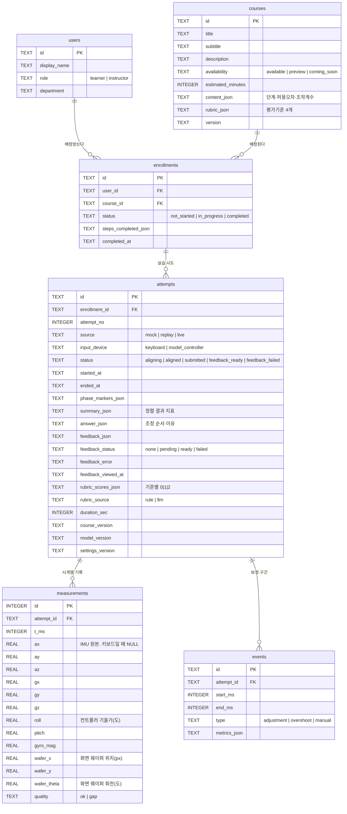

# DB 설계 — WME (We Make Experts)

> **제출물 「DB 다이어그램」의 원본 문서.**
> 기준 코드는 `web/backend/schema.sql` 이고, 이 문서는 그 스키마를 설명한다.
> 실습 과정 정의는 `실습과정_정렬.md`, 제품 정의와 원칙은 `../../PROJECT_HEAD.md` 를 따른다.
>
> 최종 수정: 2026-09-13 — 실제 스키마(`schema.sql`) 및 시드 DB(`data/local/wme.db`)와 대조 확인

## 0. 이 DB가 담당하는 것

화면(프론트)은 조작과 표시를, 서버는 분석과 검증을, **DB는 교육 기록의 영속성**을 담당한다.

WME는 기업에 판매하는 B2B 사내 기술교육 플랫폼이다. **회사가 돈을 내는 이유는
"우리 신입 기술자가 무엇을 얼마나 연습했는지 교육 담당자가 확인할 수 있다"** 는 것이다.
학습 기록이 각자의 브라우저에만 있으면 담당자 화면이 성립하지 않는다.
그래서 이 DB는 선택 사항이 아니라 제품의 성립 조건이다.

담는 것은 6가지다: **누가(users) · 무엇을(courses) · 배정받아(enrollments) ·
몇 번 연습했고(attempts) · 그때 어떻게 움직였으며(measurements) · 어디서 보정했는가(events).**

## 1. 설계 원칙

1. **화면에 보이는 모든 수치는 저장된 기록에서 계산한다.** 집계값을 따로 저장하지 않는다.
   평균·달성도·진도율은 전부 조회 시점에 계산한다. 기록이 바뀌면 그래프도 같이 바뀐다.
2. **재실습은 새 행이다.** 이전 시도를 덮어쓰지 않는다(`attempts`). 학습은 과정이지 최종값이 아니다.
3. **개인정보를 저장하지 않는다.** 비밀번호 컬럼이 없다. 데모 로그인은 인증 구현이 아니다.
4. **고정된 소규모 구조는 JSON 컬럼에 모은다.** 과정 단계·루브릭·요약처럼 항목 수가 적고
   통째로 읽고 쓰는 것은 테이블을 늘리지 않는다. 3일 일정에서 테이블 수를 늘리면
   조인만 늘고 얻는 게 없다. 검색·집계 대상이 되는 값만 컬럼으로 뺀다.
5. **재현성을 위해 버전을 시도마다 복사 저장한다.** `course_version` / `model_version` /
   `settings_version`. 나중에 과정 내용이 바뀌어도 "이 기록이 어느 버전에서 나왔는지" 남는다.
6. **값의 출처를 항상 구분한다.** `source`(시연용/재생/실측), `input_device`(키보드/모형 컨트롤러),
   `rubric_source`(규칙 채점/모델 채점), `feedback.generatedBy`(mock/llm).
   합성 데이터를 실측처럼, 규칙 채점을 AI 채점처럼 보이게 하지 않는다.

## 2. ERD



> 제출용 PNG는 위 mermaid 블록을 https://mermaid.live 에 붙여넣어 내보낸다.

## 3. 테이블

### 3.1 `users` — 사용자

| 컬럼 | 타입 | 제약 | 설명 |
|---|---|---|---|
| `id` | TEXT | PK | `u-1` ~ `u-8`, `u-instructor` |
| `display_name` | TEXT | NOT NULL | 화면 표시 이름. 데모용이며 실제 직원 정보가 아니다 |
| `role` | TEXT | NOT NULL, CHECK | `learner`(신입사원) / `instructor`(매니저) |
| `department` | TEXT | NOT NULL | 소속 표시. 데모용 |

**비밀번호 컬럼이 없다.** 데모 로그인(`1`/`1`, `2`/`2`)은 역할 전환 기능이며 인증 구현이 아니다.
화면에도 그렇게 표시한다.

### 3.2 `courses` — 과정

| 컬럼 | 타입 | 제약 | 설명 |
|---|---|---|---|
| `id` | TEXT | PK | 실습 구현 과정은 `photo-align` 하나 |
| `title` | TEXT | NOT NULL | 포토공정 입문 — 마스크·웨이퍼 정렬 실습 |
| `subtitle` | TEXT | NOT NULL | 한 줄 요약 |
| `description` | TEXT | NOT NULL | 과정 설명 |
| `availability` | TEXT | NOT NULL, CHECK | `available` / `preview` / `coming_soon` |
| `estimated_minutes` | INTEGER | NOT NULL | 예상 소요 시간 |
| `content_json` | TEXT | NOT NULL | 학습목표·단계·허용 오차·조작 계수·조정 순서 선택지 |
| `rubric_json` | TEXT | NOT NULL | 평가 기준 4개. **배열 순서가 `rubric_scores_json` 의 순서다** |
| `version` | TEXT | NOT NULL | `course-2.0.0` |

**업종 내용은 전부 이 테이블에 있다.** 코드는 업종 중립이고, 다른 업종 고객사에는
이 행의 데이터만 교체한다. 이것이 "업종 중립"을 말이 아니라 구조로 증명하는 방법이다.

시드에는 과정 5개가 들어 있다 — **실습 가능 2개**: `photo-align`(정렬 실습, `alignment`) ·
`defect-report`(판단 실습, `judgment`) / `photo-basics`(미리보기) /
`align-record` · `exposure-basics`(준비 중).

### 3.3 `enrollments` — 배정·진도

| 컬럼 | 타입 | 제약 | 설명 |
|---|---|---|---|
| `id` | TEXT | PK | |
| `user_id` | TEXT | NOT NULL, FK → users | |
| `course_id` | TEXT | NOT NULL, FK → courses | |
| `status` | TEXT | NOT NULL, CHECK | `not_started` / `in_progress` / `completed` |
| `steps_completed_json` | TEXT | NOT NULL, 기본 `[]` | 완료한 단계 ID 배열 |
| `completed_at` | TEXT | NULL | ISO8601 |
| — | | UNIQUE (user_id, course_id) | 같은 과정을 두 번 배정하지 않는다 |

**진도율은 저장하지 않는다.** `steps_completed_json` 의 개수를 과정 단계 수로 나눠 계산한다.
퍼센트를 저장하면 과정 단계가 바뀌었을 때 숫자가 거짓이 된다.

### 3.4 `attempts` — 실습 시도

| 컬럼 | 타입 | 제약 | 설명 |
|---|---|---|---|
| `id` | TEXT | PK | |
| `enrollment_id` | TEXT | NOT NULL, FK → enrollments | |
| `attempt_no` | INTEGER | NOT NULL | 같은 배정 안에서 1부터. 서버가 최댓값+1로 부여 |
| `source` | TEXT | NOT NULL, CHECK | `mock`(시연용 합성) / `replay`(저장된 재생) / `live`(실제 조작) |
| `input_device` | TEXT | NOT NULL, CHECK | `keyboard` / `model_controller` |
| `status` | TEXT | NOT NULL, CHECK | `aligning` → `aligned` → `submitted` → `feedback_ready` \| `feedback_failed` |
| `started_at` | TEXT | NOT NULL | ISO8601 |
| `ended_at` | TEXT | NULL | 정렬 확정 시각 |
| `phase_markers_json` | TEXT | NOT NULL, 기본 `[]` | 단계 전환 기록. 자동 인식 없이 화면 버튼으로만 남긴다 |
| `summary_json` | TEXT | NULL | 정렬 결과 지표 + 경로 분석 (5.3) |
| `answer_json` | TEXT | NULL | 조정 순서와 이유 (5.4) |
| `feedback_json` | TEXT | NULL | 피드백 (5.5) |
| `feedback_status` | TEXT | NOT NULL, CHECK | `none` / `pending` / `ready` / `failed` |
| `feedback_error` | TEXT | NULL | 실패 사유. 학습자 답변은 이때도 보존된다 |
| `feedback_viewed_at` | TEXT | NULL | 담당자 화면의 "확인 필요" 판단에 쓴다 |
| `rubric_scores_json` | TEXT | NULL | 기준별 `0`(미충족) / `1`(부분) / `2`(충족). `rubric_json` 과 같은 순서 |
| `rubric_source` | TEXT | NULL, CHECK | **`rule`(규칙 기반 임시 채점) / `llm`(모델 채점)** |
| `duration_sec` | INTEGER | NOT NULL, 기본 0 | 학습 활동량 집계용 |
| `course_version` | TEXT | NOT NULL | 시도 시점의 과정 버전 |
| `model_version` | TEXT | NOT NULL | 분석기 버전 `rule-align-1.0.0` (**학습 모델이 아니다**) |
| `settings_version` | TEXT | NOT NULL | 설정 버전 |
| — | | UNIQUE (enrollment_id, attempt_no) | |

**`rubric_source` 가 이 설계의 핵심 중 하나다.** 루브릭 채점은 답변 제출 시점에 서버가
규칙 기반으로 계산해 저장하고(`rule`), LLM 호출이 성공하면 그 점수로 덮어쓴다(`llm`).
**AI 피드백이 실패해도 학습 기록과 기준별 확인은 남는다.** 교육 서비스는 AI가 죽어도
멈추면 안 된다. 화면은 이 값으로 "규칙 기반 임시 채점 · AI 미연결" 과 "AI 채점" 을 구분 표시한다.

### 3.5 `measurements` — 시계열 측정값

| 컬럼 | 타입 | 제약 | 설명 |
|---|---|---|---|
| `id` | INTEGER | PK AUTOINCREMENT | |
| `attempt_id` | TEXT | NOT NULL, FK → attempts, ON DELETE CASCADE | |
| `t_ms` | INTEGER | NOT NULL | 시도 시작부터의 경과 시간 |
| `ax` `ay` `az` `gx` `gy` `gz` | REAL | NULL | IMU 원본. **키보드 조작일 때는 NULL** |
| `roll` `pitch` | REAL | NOT NULL | 컨트롤러 기울기(도). 키보드일 때는 환산된 등가 입력 |
| `gyro_mag` | REAL | NULL | 자이로 크기 |
| `wafer_x` `wafer_y` | REAL | NOT NULL | **화면 웨이퍼 마크 위치(px).** 마스크 마크 기준 상대 좌표 |
| `wafer_theta` | REAL | NOT NULL | 화면 웨이퍼 회전(도) |
| `quality` | TEXT | NOT NULL, CHECK | `ok` / `gap`(수신 끊김 구간) |
| — | | UNIQUE (attempt_id, t_ms) | 같은 시각이 두 번 들어오지 않는다 |

**`roll`/`pitch` 와 `wafer_*` 를 나눠 저장한다.** 앞은 컨트롤러 입력이고 뒤는 그 입력으로
움직인 화면 상태다. 둘을 합치면 "무엇을 했는지"와 "무엇이 일어났는지"를 구분할 수 없게 된다.

**`anomaly_score` 컬럼은 없다.** 이 과정은 이상 탐지가 아니라 정렬 실습이다
(`실습과정_정렬.md` 9절).

### 3.6 `events` — 보정 구간

| 컬럼 | 타입 | 제약 | 설명 |
|---|---|---|---|
| `id` | TEXT | PK | 피드백이 이 ID를 참조한다 |
| `attempt_id` | TEXT | NOT NULL, FK → attempts, ON DELETE CASCADE | |
| `start_ms` | INTEGER | NOT NULL | |
| `end_ms` | INTEGER | NOT NULL | CHECK (end_ms > start_ms) |
| `type` | TEXT | NOT NULL, CHECK | `adjustment`(보정 구간) / `overshoot`(과잉 보정) / `manual`(학습자 지정) |
| `metrics_json` | TEXT | NOT NULL, 기본 `{}` | 축·전후 오차 등 (5.6) |

**이 구간은 규칙 기반으로 계산한다. 모델 학습이 없다.** 계산이 명확해서 발표장에서
오탐이 날 위험이 없다.

### 3.7 인덱스

```sql
idx_enrollments_user     ON enrollments(user_id)
idx_attempts_enrollment  ON attempts(enrollment_id)
idx_attempts_started     ON attempts(started_at)
idx_measurements_attempt ON measurements(attempt_id, t_ms)
idx_events_attempt       ON events(attempt_id)
```

조회 패턴이 "한 학습자의 배정 → 그 배정의 시도 → 그 시도의 측정·구간" 이라서
외래키 방향으로만 걸었다. `measurements` 는 시간 순 조회가 항상 따라오므로 복합 인덱스다.

## 4. DDL

전문은 **`web/backend/schema.sql`** 이 기준이다. 이 문서와 코드가 다르면 코드가 맞다.
SQLite로 생성해 오류 없음을 확인했고, 시드 데이터가 실제로 들어가 있다.

```
PRAGMA foreign_keys = ON;   -- 외래키 검사를 켠다 (SQLite는 기본이 꺼짐)
PRAGMA journal_mode = WAL;  -- 동시 읽기/쓰기를 견디게 한다
```

WAL은 개발 중 발견한 동시 요청 오류 때문에 켰다. 화면이 한 번에 여러 값을 불러오므로
필요하다. 수정 전후를 직접 측정했다: 동시 30개 요청에서 18개 실패 → 수정 후 40개 전부 성공.

## 5. JSON 컬럼 구조

실제 DB에 저장된 값에서 가져온 형태다.

### 5.1 `courses.content_json`

```json
{
  "objectives":    ["...4개..."],
  "prerequisites": ["...1개..."],
  "steps":         [{"id":"concept","title":"개념 확인","summary":"..."}, "...5개..."],
  "orderOptions":  [{"id":"xy-then-theta","label":"위치를 먼저 맞추고 회전을 정리했다","hint":"..."},
                    "...4개..."],
  "tolerance":     {"position_px": 4.0, "rotation_deg": 1.0,
                    "note": "허용 오차는 교육 과정 설정값이며 실제 장비의 정렬 정밀도가 아닙니다."},
  "control":       {"deadZoneDeg": 2.0, "gainPxPerDeg": 12.0, "maxSpeedPx": 160.0,
                    "yawDeadZoneDeg": 3.0, "yawGainDegPerDeg": 2.5, "maxSpeedDeg": 30.0,
                    "keyboard": {"movePxPerSec": 90.0, "rotateDegPerSec": 22.0, "fineFactor": 0.25}},
  "alignment":     {"tolerancePx": 4, "toleranceDeg": 1, "umPerPx": 25,
                    "startOffset": {"x": 62, "y": -44, "theta": 6.5},
                    "controls": [...], "controllerNotice": "...",
                    "markLabels": {"fixed":"마스크 마크","moving":"웨이퍼 마크"},
                    "fieldRadius": 132, "materials": [...]},
  "controller":    {"mapping": "joystick", "note": "...교육용 컨트롤러...",
                    "inputDevices": ["keyboard", "model_controller"]}
}
```

**허용 오차와 조작 계수가 코드가 아니라 과정 설정값으로 여기 들어 있다.**
그래서 "손으로 정한 상수"가 아니라 "과정 설정"이라고 말할 수 있고, 다른 과정을 만들 때
값만 바꾸면 된다.

### 5.2 `courses.rubric_json`

```json
[
  {"short": "정렬 정확도", "text": "최종 오차가 과정에서 정한 허용 범위 안에 들어왔는가"},
  {"short": "조정 순서",   "text": "위치를 먼저 맞추고 회전을 정리하는 등 절차를 지켰는가"},
  {"short": "보정 효율",   "text": "과잉 보정 없이 수렴했는가"},
  {"short": "설명·기록",   "text": "왜 그 순서로 조정했는지 설명했는가"}
]
```

**4번 기준이 있어야 손재주 평가가 아니라 교육이 된다.** 1~3번만이면 게임 점수다.
`short` 는 성취도 그래프의 축 라벨이고, `text` 는 화면 표시와 AI 입력에 그대로 쓴다.

### 5.3 `attempts.summary_json`

```json
{
  "final_dx": 3.189, "final_dy": -2.12, "final_dtheta": 0.868,
  "duration_ms": 13180,
  "adjustment_count": 3, "overshoot_count": 2, "converged": true,
  "path_analysis": {
    "finalPositionError": 3.83,
    "tolerance": {"position_px": 4.0, "rotation_deg": 1.0, "note": "..."},
    "convergence": {"order": "rotation_first", "positionSettledMs": 9060,
                    "rotationSettledMs": 2480, "monotonicRatio": 0.659},
    "axisInterferenceEventIds": [],
    "overshootByAxis": {"x": 2, "y": 0, "theta": 0},
    "analyzerVersion": "rule-align-1.0.0"
  }
}
```

앞의 7개가 `실습과정_정렬.md` 6절의 측정 지표이고, `path_analysis` 는 규칙 기반 분석 결과다.
**허용 오차를 결과 안에 함께 저장한다.** 나중에 과정 설정이 바뀌어도 "그때 기준으로 통과였는지"
를 다시 판단할 수 있어야 하기 때문이다.

### 5.4 `attempts.answer_json`

```json
{
  "orderOptionId": "theta-then-xy",
  "reason": "회전을 먼저 맞추고 위치를 조정했습니다.",
  "submittedAt": "2026-09-01T15:06:11+09:00"
}
```

`orderOptionId` 는 `content_json.orderOptions` 의 id 중 하나여야 한다(서버가 검증).
**`reason` 은 학습자가 쓴 글이며 데이터다.** 서버도 AI도 그 내용을 명령으로 해석하지 않는다.

### 5.5 `attempts.feedback_json`

```json
{
  "generatedBy": "mock",
  "good":    ["두 마크를 과정에 설정된 허용 범위 안으로 맞췄습니다."],
  "improve": ["회전을 먼저 맞춘 뒤 위치를 조정해서, 맞춰 둔 값이 다시 틀어졌습니다.", "..."],
  "eventIds": ["e-u-1-stage-a1-ovr-1", "e-u-1-stage-a1-ovr-2"],
  "nextStep": "같은 과정을 한 번 더 하면서, 목표 근처에서는 움직이는 양을 절반으로 줄여 보세요.",
  "cannotJudge": ["실제 장비의 정렬 정밀도나 설비 상태는 이 기록으로 판단할 수 없습니다.",
                  "허용 오차는 교육 과정 설정값입니다."],
  "generatedAt": "2026-09-01T15:06:31+09:00"
}
```

- `generatedBy`: `mock`(규칙 기반 샘플) / `llm`(실제 모델 호출). 화면에 구분 표시한다
- `eventIds`: 피드백이 근거로 삼은 보정 구간. **서버가 실재하는 ID인지 검증한 것만 남긴다**
- `cannotJudge`: **판단할 수 없는 것을 명시적으로 적는다.** AI가 모든 것을 아는 것처럼
  보이지 않게 하기 위한 장치다

### 5.6 `events.metrics_json`

```json
// type: "adjustment"
{"axis": "xy", "errorBefore": 75.589, "errorAfter": 44.13,
 "dominantAxis": "x", "movedX": -58.296, "movedY": -0.043, "movedTheta": -0.003,
 "posErrorBefore": 75.589, "posErrorAfter": 44.13,
 "thetaErrorBefore": 0.858, "thetaErrorAfter": 0.855,
 "axisInterference": 0.001, "axisInterferenceFlag": false,
 "secondaryAxis": "y", "improved": true}

// type: "overshoot"
{"axis": "xy", "movedAxis": "x", "peak_ms": 4300,
 "errorBefore": 1.462, "errorAfter": 8.621,
 "overshootAmount": 15.017, "unit": "px"}
```

`axis`(`xy` / `theta`)를 컬럼이 아니라 JSON 안에 둔 이유는, 축 관련 정보가 축 이름 하나가
아니라 여러 개의 묶음이기 때문이다. 컬럼으로 빼면 나머지가 흩어진다.

### 5.7 그 외 작은 JSON

| 컬럼 | 형태 |
|---|---|
| `enrollments.steps_completed_json` | `["concept","marks","align"]` |
| `attempts.phase_markers_json` | `[{"phase":"aligning","tMs":0},{"phase":"confirmed","tMs":13180}]` |
| `attempts.rubric_scores_json` | `[1, 2, 1, 1]` — `rubric_json` 과 같은 순서 |

## 6. 애플리케이션이 지켜야 할 제약

DB 제약만으로는 막을 수 없어 서버가 검증하는 것들이다.

1. **상태 전이** — `aligning → aligned → submitted → feedback_ready | feedback_failed`.
   역방향·건너뛰기를 막는다. 위반 시 409
2. **`attempt_no`** — 같은 배정 안의 최댓값 + 1. 클라이언트가 정하지 않는다
3. **준비 중 과정** — `availability != 'available'` 인 과정은 시도를 만들 수 없다. 409
4. **`orderOptionId`** — 그 과정의 `orderOptions` 에 있는 id여야 한다. 아니면 422
5. **피드백 `eventIds`** — 그 시도에 실재하는 event id만 남긴다. 없는 ID는 버린다
6. **루브릭 점수** — 항목 수가 `rubric_json` 길이와 같아야 하고 값은 0·1·2만
7. **`converged`** — 화면이 보낸 값을 믿지 않는다. 서버가 마지막 측정값과 허용 오차로 다시 계산한다
8. **답변 보존** — LLM 호출이 실패해도 `answer_json` 을 지우지 않는다.
   `feedback_status='failed'` 로만 표시하고 재시도할 수 있게 한다

## 7. 설계에서 내린 판단

**왜 SQLite인가** — 로컬 데모가 전제이고 배포 요구가 없다. 파일 하나라 이어받기와 백업이 쉽다.
동시 사용자가 없으므로 WAL만 켜면 충분하다.

**왜 시계열을 테이블로 두는가** — `measurements` 는 유일하게 행이 많이 쌓이는 테이블이다
(1분 실습 × 초당 50회 = 3,000행). 결과 화면의 보정 궤적 그래프가 이 기록을 그대로 그린다.
JSON 한 칸에 넣으면 구간 조회를 할 수 없다.

**왜 집계값을 저장하지 않는가** — 저장하면 원본과 어긋날 수 있고, 어긋난 순간
"화면 숫자를 손으로 적어 넣었다"는 의심을 받는다. 계산 비용보다 신뢰가 중요하다.

**왜 시드의 루브릭 값을 그대로 저장하지 않는가** — 시드 데이터의 루브릭 값은
"어떤 시도였는지"(궤적 모양·고른 순서·이유의 자세함)를 정의하는 데만 쓰고,
저장되는 점수는 **채점기가 그 궤적을 실제로 읽어서 계산한 값**이다.
그래서 `rubric_source='rule'` 이 사실과 맞는다.

**왜 `input_device` 를 따로 두는가** — `source`(mock/replay/live)는 데이터의 성격이고,
`input_device` 는 조작 수단이다. 키보드로 한 실제 조작은 `live` + `keyboard` 다.
둘을 한 컬럼에 합치면 이 조합을 표현할 수 없다.

## 8. 아직 정하지 않은 것

- **수평(평행) 판정 허용 범위** — 센서 모드의 2단계 조작을 위해 필요하다.
  지금은 프론트 상수 `LEVEL_TOLERANCE_DEG = 2.0` 에 있고, 실측 후 `content_json` 으로 옮긴다
- **회전(θ)을 센서 yaw로 받을지** — 드리프트 측정 결과로 정한다.
  못 쓰면 화면 버튼 유지이며, 이 경우에도 스키마는 바뀌지 않는다

## 9. 제출물로 내보내는 방법

1. 2절의 mermaid 블록을 https://mermaid.live 에 붙여넣는다
2. PNG로 내보낸다
3. 파일명 `WME_DB다이어그램.png` 로 `제출/` 에 둔다

## 10. 대조 확인 기록 (2026-09-13)

이 문서는 추정이 아니라 실제 코드·DB와 대조해 작성했다.

| 확인 대상 | 결과 |
|---|---|
| `web/backend/schema.sql` 6테이블·컬럼·CHECK | 문서와 일치 |
| `data/local/wme.db` 실제 행 수 | users 9 · courses 5 · enrollments **17** · attempts **14**(정렬 12 + 판단 2) — *2026-09-14 재조회* |
| 5절 JSON 예시 | 시드 DB에서 직접 조회한 값 |
| `rubric_source` 컬럼 | `schema.sql:82` 에 존재 확인 |
