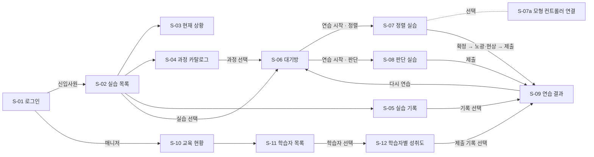

# 화면 설계 · UI 흐름 — WME

> **제출물 `{반_이름_WME}-개요.pdf` 의 "UI 흐름(와이어프레임)" 원본.** PDF 에는 **실제 화면 캡처**를 붙인다(과제 필수).
> 기준: 실제 구현 `web/frontend/src/pages`, API `제출/WME-API.yml`, DB `제출/WME-DB.dbml` — 2026-09-14 코드 대조
> 기능 ID(FR-xx)는 `서비스개요.md` 3절. **[설계]** = 시연 앱에 구현하지 않은 것

---

## 1. 화면 목록

| ID | 화면 | 경로 | 액터 | 기능 |
|---|---|---|---|---|
| S-01 | 로그인 | `/login` | 공통 | FR-C01 |
| S-02 | 실습 목록 | `/learn` | 신입사원 | FR-L01 |
| S-03 | 현재 상황 | `/learn/status` | 신입사원 | FR-L02 |
| S-04 | 과정 카탈로그 | `/learn/courses` | 신입사원 | FR-L03 |
| S-05 | 실습 기록 | `/learn/records` | 신입사원 | FR-L04 |
| S-06 | 대기방 (과정 상세) | `/courses/:courseId` | 신입사원 | FR-L05 |
| S-07 | 정렬 실습 | `/attempts/new?courseId=photo-align` | 신입사원 | FR-L06·07·09·10·14 |
| S-07a | └ 교육용 모형 컨트롤러 연결 (S-07 안 패널) | 〃 | 신입사원 | FR-L08 |
| S-08 | 판단 실습 | `/attempts/new?courseId=defect-report` | 신입사원 | FR-L06·11·14 |
| S-09 | 연습 결과 | `/attempts/:attemptId/result` | 공통 | FR-L12·13·15, FR-M03 |
| S-10 | 교육 현황 | `/instructor` | 매니저 | FR-M01 |
| S-11 | 학습자 목록 | `/instructor/learners` | 매니저 | FR-M02 |
| S-12 | 학습자별 성취도 | `/instructor/learners/:learnerId` | 매니저 | FR-M03 |

**라우트 11개 + 실습 유형 2종**(S-07·S-08 은 같은 경로에서 과정의 `exerciseType` 으로 갈린다).
역할별 접근 제한: 신입사원은 `/learn`·`/courses`·`/attempts`, 매니저는 `/instructor` 로만 들어간다.

## 2. 전체 흐름

---

## 3. 화면별 상세

각 화면: 목적 / 구성 요소 / 사용자 동작 / 호출 API / 예외. 캡처 번호(C-xx)는 5절.

### S-01 로그인 — C-01, C-02
- **목적**: 역할에 맞는 첫 화면으로 들어간다
- **구성**: 아이디 입력, 비밀번호 입력, `로그인` 버튼, 데모 계정 안내(신입사원 1/1, 매니저 2/2) 버튼, "인증 구현이 아닌 데모 전환" 고지
- **동작**: 로그인 → 신입사원은 S-02, 매니저는 S-10
- **API**: [설계] `POST /api/auth/login` → `user.role` 로 분기 / 시연 앱은 데모 계정으로 전환 후 `GET /api/users/{user_id}`
- **예외**: 불일치 시 "아이디 또는 비밀번호가 맞지 않습니다." (C-02)

### S-02 실습 목록 — C-03
- **목적**: 지금 해야 할 실습과 끝낸 실습을 한눈에
- **구성**: 인사말("실장비 앞에 서기 전에 연습합니다"), `해야 할 실습` 카드(과정명·진도·최근 결과), `완료한 실습` 카드, 빈 상태("지금 해야 할 실습이 없습니다")
- **동작**: 카드 선택 → S-06
- **API**: `GET /api/courses`, `GET /api/enrollments?userId`, `GET /api/attempts?userId`

### S-03 현재 상황 — C-04
- **목적**: 반복하면서 나아지는지 확인
- **구성**: 연습 횟수·총 시간·진도·정확도 지표, 기준별 달성도(막대), 시도별 추이(선), 연습마다 걸린 시간
- **API**: `GET /api/attempts?userId`, `GET /api/courses/{course_id}` — **집계는 화면이 원본 기록에서 계산**

### S-04 과정 카탈로그 — C-05
- **구성**: 과정 카드(제목·부제·예상 시간·상태 배지 `실습 가능`/`미리보기`/`준비 중`·배정 여부)
- **동작**: 카드 선택 → S-06
- **API**: `GET /api/courses`, `GET /api/enrollments?userId`

### S-05 실습 기록 — C-06
- **구성**: 시도 표(과정·회차·일시·입력 장치 `키보드 조작`/`모형 컨트롤러`·통과 여부), 빈 상태
- **동작**: 행 선택 → S-09
- **API**: `GET /api/attempts?userId`, `GET /api/courses`

### S-06 대기방 — C-07
- **목적**: 시작 전에 무엇을 어떤 기준으로 하는지 안다
- **구성**: 어떤 연습인가요(목표), 이렇게 진행합니다(단계), 확인 기준(루브릭 4개), 준비물, "왜 실장비가 아니라 여기서 연습하나요", `연습 시작`/`다시 연습 시작` 버튼
- **API**: `GET /api/courses/{course_id}`, `GET /api/enrollments?userId`, `GET /api/attempts?userId`
- **예외**: 실습 불가 과정은 버튼 대신 "준비 중입니다" / "소개만 열람할 수 있습니다" (서버도 409)

### S-07 정렬 실습 — C-08 ~ C-13
- **목적**: 3D 장비 뷰에서 웨이퍼를 마스크 마크에 맞추고, 그 순서와 이유를 남긴다
- **구성**
  - **장비 뷰(3D)** — 스테이지·웨이퍼·마스크 판, 마우스로 시점 회전, `시점 초기화` (C-08)
  - **현미경 뷰** — 고정 마스크 마크 + 움직이는 웨이퍼 마크 + 허용 범위 상자 + 지나온 경로
  - **남은 오차** — 위치 오차(px), 회전 오차(°), 허용 범위 안/밖 판정(색·링·문장 함께)
  - **조작 방법** — 방향키 X/Y · Q/E 회전 · Shift 미세조정 (`alignment.controls`), 키보드 모드에서 W/S·A/D 기울기 (`alignment.tiltControls`), 수평 상태·`수평으로 되돌리기`
  - **입력 장치 선택** — `키보드 조작`(기본) / `모형 컨트롤러`
  - `정렬 확정` 버튼
  - **공정 연출** — 노광 → 현상액 낙하·퍼짐 → 오차만큼 어긋난 패턴 + 통과 배지 (C-09 허용 범위 안, C-10 크게 어긋남)
  - **제출 폼**(확정 후에만 나타남) — 조정 순서 선택지(`orderOptions`), 이유 입력, `제출` (C-11)
- **동작**: 연습 시작 → 조작 → 정렬 확정 → 연출 → 조정 순서·이유 제출 → S-09. `다시 조정하기`/`처음부터 다시`
- **API**: `POST /api/attempts` → WebSocket `sample`(초당 약 25회)·`state` → `POST /api/attempts/{attempt_id}/phase`(confirmed) → `POST /api/attempts/{attempt_id}/submission` → `PATCH /api/enrollments/{enrollment_id}/progress`(※ M1 연결 예정)
- **예외**: 서버 오류 시 안내, WebGL 불가 시 2D 현미경 뷰로 자동 대체, 확정 전에는 제출 폼 없음

### S-07a 교육용 모형 컨트롤러 연결 — C-12, C-13
- **구성**: 컨트롤러 상태 패널(모형 자세 표시, `수신 없음`/`기준 안`/`기준 밖`), `연결`·`영점 잡기`·`키보드로 진행` 버튼, 1단계 수평 맞추기(허용 ±2.0°) → 2단계 회전(수평일 때만 반영), 교육용 컨트롤러 고지
- **API**: 없음 — 브라우저가 USB 시리얼(Web Serial)로 직접 읽는다. 조작 결과 좌표만 S-07 WebSocket 으로 기록
- **예외 흐름 (가점 항목)**

| 상황 | 화면 문구 | 사용자가 할 수 있는 것 |
|---|---|---|
| 브라우저 미지원 | "이 브라우저는 USB 시리얼 연결(Web Serial)을 지원하지 않습니다. 크롬 계열 브라우저에서 열거나 키보드로 진행하세요." | 키보드로 진행 |
| 미연결 | "모형 컨트롤러가 연결되지 않았습니다. 아래 연결 버튼을 눌러 USB 포트를 선택하세요." | 연결 |
| 포트 미선택 | "포트를 선택하지 않았습니다. 다시 연결하거나 키보드로 진행할 수 있습니다." | 다시 연결 / 키보드 |
| 연결 끊김 | "연결이 끊어졌습니다. USB 를 다시 연결하거나 키보드로 진행하세요." | 다시 연결 / 키보드 |
| 수신 없음 | 패널 `수신 없음` | 보드 확인 / 키보드 |
| 수평 깨짐 | "먼저 수평을 맞추세요. 수평이 확보되어야 회전 입력이 반영됩니다." | 수평 맞추기 |

### S-08 판단 실습 — C-14, C-15
- **목적**: 조작 없이 상황을 읽고 무엇을 먼저 확인할지 정한다
- **구성**: 상황 카드(`scenario.situation`), 관측값 표(`observations`), 확인 항목 목록 + 위/아래 버튼(`checkItems`), 이유 입력, `제출`. **제출 전에는 권장 순서·근거를 보여주지 않는다**
- **API**: `POST /api/attempts` → `POST /api/attempts/{attempt_id}/submission`(`orderedIds`, `reason`) → `PATCH .../progress`(※ M1)
- **예외**: 항목을 위/아래로만 옮기므로 화면에서 누락·중복이 생기지 않는다. 서버가 422 로 한 번 더 막는다

### S-09 연습 결과 — C-16 ~ C-19
- **구성**
  - 한 줄 요약(통과 여부 + 가장 약한 기준)
  - **정렬**: 최종 위치·회전 오차, 소요 시간, 보정 횟수, 과잉 보정, 허용 범위, 통과 배지 / 보정 궤적(경로 + 오차 감소 그래프) (C-16)
  - **판단**: 내 순서 vs 권장 순서 비교표, 근거(`rationale`), 권장 순서 고지(`orderNote`) (C-17)
  - 제출 답변
  - **기준별 확인** — 루브릭 4기준 점수 + 채점 출처 배지(`규칙 기반 임시 채점 · AI 미연결` / `AI 채점`) + 기준별 이유 (C-18)
  - **AI 피드백** — 잘한 점 · 개선할 점 · 근거 구간 · 다음 연습 · 판단할 수 없는 것 / 실패 시 사유 + "제출한 답변과 연습 기록은 그대로 저장되어 있습니다" + `다시 시도` (C-19)
  - 시도 목록, 버전 기록, `다시 연습`
- **API**: `GET /api/attempts/{attempt_id}`, `GET /api/attempts?userId`, `GET /api/courses/{course_id}`, `GET /api/users/{user_id}`, `POST /api/attempts/{attempt_id}/feedback`, `POST .../feedback/viewed`(※ M2 연결 예정)
- **예외**: 없는 기록 "존재하지 않는 실습 기록입니다", 피드백 503

### S-10 교육 현황 — C-20
- **구성**: 반 요약 지표, 학습자별 진도(단계 완료 비율), 기준별 평균 달성도, 주차별 활동
- **API**: `GET /api/instructor/overview`, `GET /api/courses/{course_id}` — 집계는 화면이 계산

### S-11 학습자 목록 — C-21
- **구성**: 학습자 표(이름·소속·진도·시도 수·최근 결과·확인 필요)
- **동작**: 행 선택 → S-12
- **API**: `GET /api/instructor/overview`

### S-12 학습자별 성취도 — C-22
- **구성**: 학습자 정보, 기준별 달성도·추이, **제출 기록**(과정 열 포함, 시도별 답변·피드백 열기)
- **동작**: 기록 선택 → S-09
- **API**: `GET /api/users/{user_id}`, `GET /api/attempts?userId`, `GET /api/enrollments?userId`, `GET /api/courses`
- **예외**: "존재하지 않는 학습자입니다"

---

## 4. UI ↔ API ↔ DB 대조표

> 세부 평가 기준 "UI 데이터와 API 불일치", "UI 데이터가 ERD 에 없음" 을 막기 위한 표.
> API 필드는 `WME-API.yml` components/schemas, **ERD(논리 설계)** 는 `WME-DB.dbml`,
> **시연 앱 저장**은 `web/backend/schema.sql` (`→` 는 JSON 컬럼 안의 필드).
> ERD 는 화면 데이터를 전부 테이블·컬럼으로 드러내고, 시연 앱은 같은 데이터를 JSON 컬럼에 모아 저장한다(`과제요건.md` R6).

| 화면 | 화면에 보이는 데이터 | API 필드 | ERD (논리 설계) | 시연 앱 저장 |
|---|---|---|---|---|
| 공통 | 이름·소속·역할 | `User.displayName` `department` `role` | `users.display_name` `department` `role` | `users` 같은 컬럼 |
| S-01 | 아이디·비밀번호 | [설계] `LoginRequest.loginId` `password` | [설계] `users.login_id` `password_hash` | 없음 (데모 로그인) |
| S-02·04 | 과정명·부제·예상 시간·상태 | `Course.title` `subtitle` `estimatedMinutes` `availability` | `courses` 같은 컬럼 | `courses` 같은 컬럼 |
| S-02·10 | 진도 | `Enrollment.stepsCompleted` ÷ `Course.steps` 수, `Enrollment.status` | `enrollment_steps`(M:N) ÷ `course_steps`, `enrollments.status` | `enrollments.steps_completed_json` |
| S-05 | 회차·일시·입력 장치 | `Attempt.attemptNo` `startedAt` `inputDevice` | `attempts.attempt_no` `started_at` `input_device` | 같은 컬럼 |
| S-06 | 목표·사전 지식·준비물 | `Course.objectives` `prerequisites` `alignment.materials` | `course_guides` (kind = objective / prerequisite / material) | `courses.content_json` |
| S-06 | 진행 단계 | `Course.steps[]` | `course_steps` | `courses.content_json → steps` |
| S-06·09 | 확인 기준(루브릭) | `Course.rubric[].short` `text` | `rubric_criteria.short_name` `description` | `courses.rubric_json` |
| S-07 | 허용 범위·시작 오차·마크 이름·고지 | `AlignmentSettings.tolerancePx` `toleranceDeg` `startOffset` `markLabels` `controllerNotice` | `alignment_settings` (과정 1:1) | `courses.content_json → alignment` |
| S-07 | 조작 안내 | `AlignmentSettings.controls` `tiltControls` | `course_guides` (kind = control / tilt_control) | `content_json → alignment.controls, tiltControls` |
| S-07 | 조작 계수 (표시 안 함) | `Course.control` | `alignment_settings.control_coefficients` | `content_json → control` |
| S-07 | 실시간 웨이퍼 위치·기울기 | WS `sample` = `Sample.waferX/Y/Theta` `roll` `pitch` | `measurements` | `measurements` |
| S-07 | 남은 오차·통과 판정 | WS `state.dx/dy/dtheta` `withinTolerance` | 계산값 (저장 안 함) | 계산값 |
| S-07 | 조정 순서 선택지 | `Course.orderOptions[]` | `order_options` | `content_json → orderOptions` |
| S-07 | 제출한 조정 순서·이유 | `Answer.orderOptionId` `reason` `submittedAt` | `attempts.order_option_id`(FK) `reason` `submitted_at` | `attempts.answer_json` |
| S-08 | 상황·관측값 | `Scenario.situation` `observations[]` | `judgment_scenarios.situation`, `scenario_observations` | `content_json → scenario` |
| S-08 | 확인 항목 | `Scenario.checkItems[]` | `check_items.item_key` `label` `display_order` | `content_json → scenario.checkItems` |
| S-08 | 제출한 확인 순서 | `Answer.orderedIds[]` | `attempt_check_orders`(M:N) `position` | `attempts.answer_json` |
| S-09 | 최종 오차·시간·보정·과잉 보정·통과 | `AlignmentSummary.finalDx/Dy/DTheta` `durationMs` `adjustmentCount` `overshootCount` `converged` | `attempts` 같은 이름 컬럼 | `attempts.summary_json` |
| S-09 | 경로 분석 상세 | `AlignmentSummary.pathAnalysis` `scoringMetrics` | `attempts.analysis_detail` | `attempts.summary_json` |
| S-09 | 보정 궤적 | `Attempt.samples[]` | `measurements` | `measurements` |
| S-09 | 보정·과잉 보정 구간 | `Attempt.events[]` | `events` | `events` |
| S-09 | 권장 순서·근거·고지 | `Scenario.recommendedOrder` `rationale` `orderNote` | `check_items.recommended_rank`, `judgment_scenarios.rationale` `order_note` | `content_json → scenario` |
| S-09 | 순서 지표 | `JudgmentSummary.scoringMetrics.firstPickRank` `orderDistance` `top3Overlap` `passed` | `attempts.first_pick_rank` `order_distance` `top3_overlap` `passed` | `attempts.summary_json` |
| S-09 | 기준별 점수·이유 | `Attempt.rubricScores[]` `rubricReasons[]` | `attempt_rubric_scores`(M:N) `score` `reason` | `attempts.rubric_scores_json` (이유는 조회 시 계산) |
| S-09 | 채점 출처 배지 | `Attempt.rubricSource` | `attempts.rubric_source` | 같은 컬럼 |
| S-09 | AI 피드백 문장 | `Feedback.good[]` `improve[]` `cannotJudge[]` | `feedback_items` (kind) | `attempts.feedback_json` |
| S-09 | 피드백 근거 구간 | `Feedback.eventIds[]` | `feedback_evidence`(M:N) | `attempts.feedback_json → eventIds` |
| S-09 | 다음 연습·생성 정보 | `Feedback.nextStep` `generatedBy` `generatedAt` | `attempts.feedback_next_step` `feedback_generator` `feedback_created_at` | `attempts.feedback_json` |
| S-09 | 피드백 상태·실패 사유·열람 | `Attempt.feedbackStatus` `feedbackError` `feedbackViewedAt`, 503 `FeedbackError` | `attempts.feedback_status` `feedback_error` `feedback_viewed_at` | 같은 컬럼 |
| S-09 | 버전 기록 | `Attempt.courseVersion` `modelVersion` `settingsVersion` | `attempts` 같은 이름 컬럼 | 같은 컬럼 |
| S-10·11 | 시도 수·최근 결과·확인 필요 | `InstructorRow.attemptCount` `latestAttempt` `needsReview` | `attempts` 에서 계산 | 계산값 |

### 코드 대조에서 찾은 불일치 (2026-09-14)

| # | 내용 | 조치 |
|---|---|---|
| M1 | 진도 기록 API(`PATCH /progress`)를 어떤 화면도 부르지 않음 → 진도가 시드에서 안 바뀐다 | FRONT — S-07·S-08 단계 완료 시 호출 |
| M2 | 피드백 열람 API(`POST /feedback/viewed`)를 부르지 않음 | FRONT — S-09 에서 피드백이 보이면 호출 |
| M3 | 로그인 화면에 대응 API 없음 | 설계에 추가(`[설계]`) — 구현하지 않음 |

---

## 5. 캡처 목록 (FRONT 가 만든다 → PDF UI 흐름도)

- **server 모드**(`npm run dev:server`, http://localhost:5174)에서 찍는다. 화면에 `실습 서버 연결` 배지가 보여야 한다
- 브라우저 너비 1440px 기준, 개인정보·개발 도구 없이
- 저장 위치: `제출/캡처/C-xx_화면이름.png` (FRONT 예외 허용 폴더)
- 강조 박스·화살표·설명은 HEADER 가 PDF 를 만들 때 넣는다

| 번호 | 화면 | 상태 |
|---|---|---|
| C-01 | S-01 로그인 | 빈 입력 |
| C-02 | S-01 로그인 | 틀린 비밀번호 오류 문구 |
| C-03 | S-02 실습 목록 | 김진수(1/1) 로그인 직후 |
| C-04 | S-03 현재 상황 | 그래프가 보이게 |
| C-05 | S-04 과정 카탈로그 | 상태 배지 3종이 보이게 |
| C-06 | S-05 실습 기록 | 목록 |
| C-07 | S-06 대기방 | 정렬 실습 과정, 확인 기준까지 |
| C-08 | S-07 정렬 실습 | 조작 중 (3D 장비 뷰 + 현미경 뷰 + 남은 오차) |
| C-09 | S-07 정렬 실습 | 허용 범위 안에서 확정 → 패턴이 겹쳐 찍힌 결과 |
| C-10 | S-07 정렬 실습 | 크게 어긋난 채 확정 → `패턴이 어긋남` |
| C-11 | S-07 정렬 실습 | 제출 폼 (조정 순서 + 이유) |
| C-12 | S-07a 모형 컨트롤러 | 연결 안 됨 / 미지원 안내 + `키보드로 진행` |
| C-13 | S-07a 모형 컨트롤러 | 수평 깨짐 → 회전 잠김 (키보드 W/A/S/D 로 재현 가능) |
| C-14 | S-08 판단 실습 | 상황·관측값·확인 항목 |
| C-15 | S-08 판단 실습 | 순서 배열 + 이유 입력 |
| C-16 | S-09 결과 (정렬) | 정렬 결과 + 보정 궤적 |
| C-17 | S-09 결과 (판단) | 순서 비교표 + 근거 |
| C-18 | S-09 결과 | 기준별 확인 (채점 출처 배지) |
| C-19 | S-09 결과 | AI 피드백 실패 → 답변 보존 안내 + 다시 시도 |
| C-20 | S-10 교육 현황 | 최태원(2/2) 로그인 직후 |
| C-21 | S-11 학습자 목록 | 목록 |
| C-22 | S-12 학습자별 성취도 | 제출 기록까지 |
